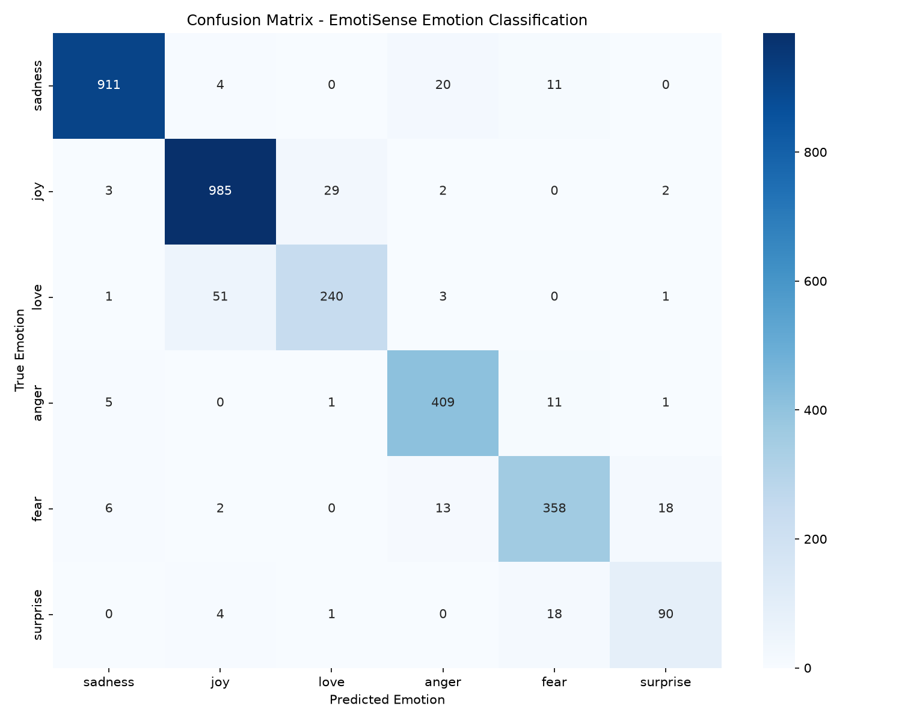

# EmotiSense

**EmotiSense** is a mental health and emotion classification tool powered by a fine-tuned **BERT (`bert-base-uncased`)** sequence classification model. It achieves **94% accuracy** on the Hugging Face `emotion` dataset across 6 core emotion classes: *sadness*, *joy*, *love*, *anger*, *fear*, and *surprise*.

The project combines a Flask backend for real-time inference with an intuitive Bootstrap-based web interface.

---

## 📊 Model Performance & Evaluation

### Key Metrics
- **Overall Accuracy**: `94.0%` (`0.9353` validation accuracy)
- **Weighted F1 Score**: `0.9350`
- **Training Time**: ~57.7 minutes (3,461 seconds) for 3 epochs (2,400 steps)
- **Hardware / Device**: Apple Silicon Mac (Metal / MPS PyTorch acceleration)

### Detailed Classification Report

```text
              precision    recall  f1-score   support

     sadness       0.98      0.96      0.97       946
         joy       0.94      0.96      0.95      1021
        love       0.89      0.81      0.85       296
       anger       0.91      0.96      0.94       427
        fear       0.90      0.90      0.90       397
    surprise       0.80      0.80      0.80       113

    accuracy                           0.94      3200
   macro avg       0.90      0.90      0.90      3200
weighted avg       0.94      0.94      0.93      3200
```

### Confusion Matrix Analysis



#### Insights & Performance Analysis:
1. **High Precision on Sadness & Joy**: The model performs exceptionally well on high-frequency emotions like `sadness` (97% F1) and `joy` (95% F1), which comprise the majority of the dataset.
2. **Semantic Overlap (`Love` vs `Joy`)**: The lowest recall occurs on `love` (81%), primarily due to semantic overlap with `joy` in informal text expressions.
3. **Low-Frequency Classes (`Surprise`)**: `surprise` has lower metrics (80% F1) primarily due to dataset imbalance (only 113 validation samples compared to >1000 for `joy`).

---

## 🛠️ Tech Stack

- **Model**: `bert-base-uncased` (Hugging Face Transformers, PyTorch, Accelerate)
- **Evaluation**: Scikit-Learn, Seaborn, Matplotlib
- **Backend**: Flask
- **Frontend**: HTML5, CSS3, Bootstrap 5

---

## 🚀 Getting Started

### 1. Clone the repository
```bash
git clone https://github.com/om952/Sentiment-Analysis.git
cd Sentiment-Analysis
```

### 2. Install dependencies
```bash
pip install -r requirements.txt
```

### 3. (Optional) Train the model locally
If you wish to re-train the model and re-generate the confusion matrix:
```bash
python model.py
```
*This will fine-tune BERT and export the saved model weights to `./emotion_model` and plot `./confusion_matrix.png`.*

### 4. Run the web application
```bash
python app.py
```

Open your browser and navigate to `http://127.0.0.1:5000/` to test real-time emotion predictions.

---

## 📜 License
This project is licensed under the MIT License - see the [LICENSE](LICENSE) file for details.
